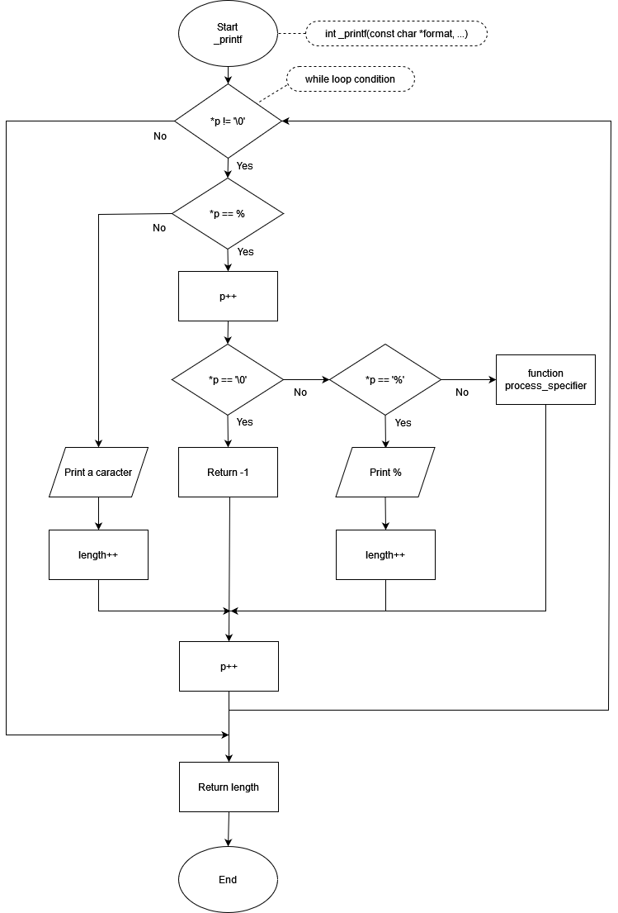

# Printf Function

## Description 
This project implements a custom `_printf` function that produces output according to a format string. The function mimics the behavior of the standard C library function printf, but with a limited set of conversion specifiers.
The available conversion specifiers are: c, s, d, i, %, b, u, o, x, X, S, p.

### Conversion Specifiers
- **c**: The `int` argument is converted to an `unsigned char`, and the resulting character is written.
- **s**: The `char *` argument is expected to be a pointer to an array of characters. Characters from the array are written up to (but not including) a terminating null byte (`'\0'`).
- **d, i**: The `int` argument is converted to a signed decimal notation.
- **%**: A '%' is written. No argument is converted. The complete conversion specification is '%%'.
- **b**: The `unsigned int` argument is converted to binary notation.
- **u**: The `unsigned int` argument is converted to unsigned decimal notation.
- **o**: The `unsigned int` argument is converted to unsigned octal notation.
- **x**: The `unsigned int` argument is converted to unsigned hexadecimal notation, using the letters "abcdef".
- **X**: The `unsigned int` argument is converted to unsigned hexadecimal notation, using the letters "ABCDEF".
- **S**: The `char *` argument is expected to be a pointer to an array of characters. Non-printable characters (ASCII value < 32 or >= 127) are printed this way: `\x`, followed by the ASCII code value in hexadecimal (upper case - always 2 characters).
- **p**: The `void *` pointer argument is printed in hexadecimal.

## Compilation
The code should be compiled using the following command:
```gcc -Wall -Wextra -Werror -pedantic -std=gnu89 -Wno-format *.c```

## Manual page
To open the manual, use the following command :
```man ./man_3_printf```

## Requirements
- All files will be compiled on Ubuntu 20.04 LTS using gcc
- Code should follow the Betty style guide
- No global variables are allowed
- Maximum of 5 functions per file
- Prototypes of all functions should be included in the header file main.h
- Header files should be include guarded
- Example Usage
```c
#include "main.h"

int main(void)
{
    _printf("Hello, %s!\n", "world");
    _printf("Character: %c\n", 'A');
    _printf("Percent sign: %%\n");
    return (0);
}
```
## Flowchart


## Testing
To test the ``_printf function``, create a separate test folder containing main files with various test cases. 
Then use _printf() with your own arguments.

## Authors

[Mano Delcourt](https://github.com/Maniok19)
[Warren Gomes Martins](https://github.com/Warrre)